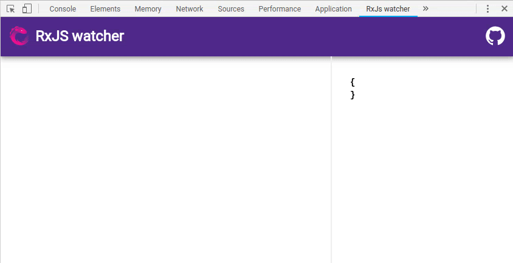
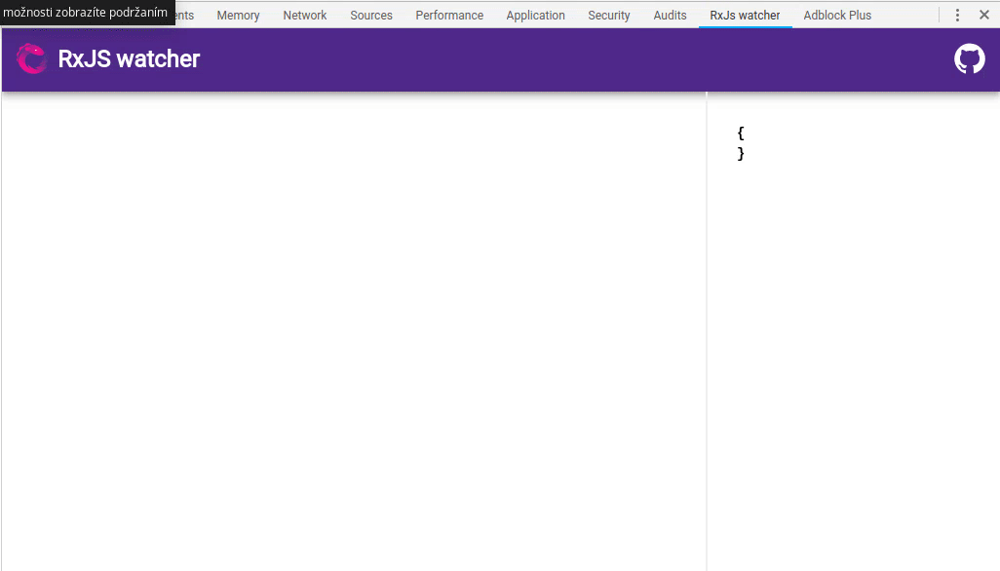

# RxJS watcher

Simple chrome devtools extension to visualize Rxjs observables.

## Installation

### Install npm package

`npm i rxjs-watcher`

### Install extension

Install [rxjs-watcher extension](https://chrome.google.com/webstore/detail/rxjs-watcher/dfpjfjpfpjjgoeackldilanadoeaciam)


## How to use

To see marbles in extension you have to use "watch" operator from rxjs-watcher package. 

Operator takes 2 arguments: 
- marbleName: string (label to show above marble)
- duration: number (duration in seconds, default value is 10)

```ts
import {watch} from 'rxjs-watcher'

interval(1000).pipe(
    watch('interval(1000)')
    filter(value => value % 2 === 0),
    watch('filter even')
).subscribe()

```


You can also group your marbles in to sections by using "getGroup" functions which returns rxjs operator.

getGroup function takes 2 arguments:
- groupName: string (name to show for group)
- duration: number (duration in seconds that will be used for marbles in group, default is 10) 

```ts
import {getGroup} from 'rxjs-watcher'

const innerWatch = getGroup('inner', 3);
interval(2000).pipe(
  watch('interval'),
  switchMap(() => interval(500).pipe(
    innerWatch('interval 500')
  )),
  watch('switchMap'),
  take(10)
).subscribe();

```

