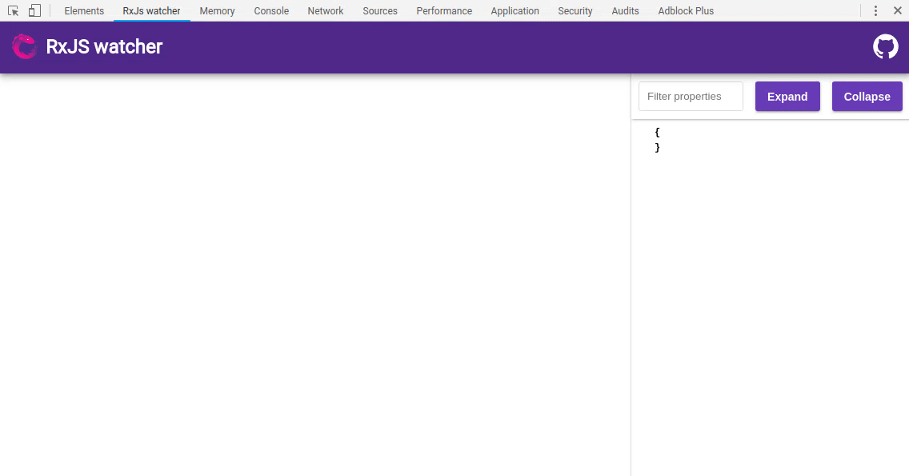
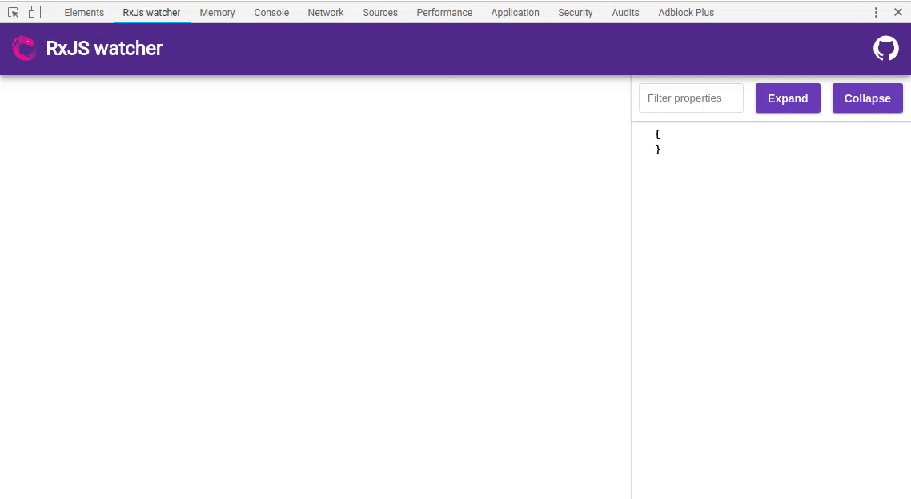
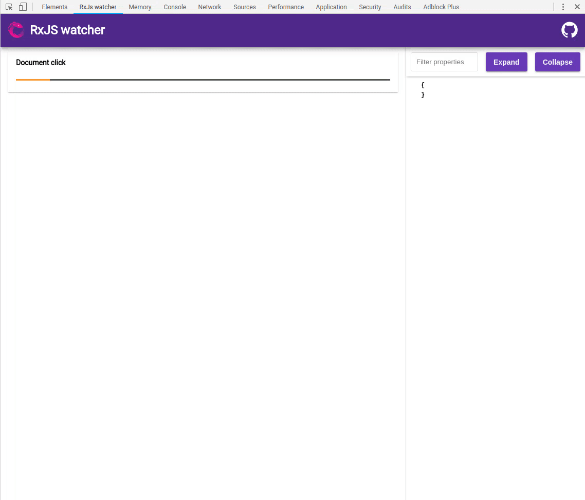

# RxJS watcher

Simple chrome devtools extension to visualize Rxjs observables.

## Installation

### Install npm package

`npm i rxjs-watcher --save-dev`

### Install extension

Install [rxjs-watcher extension](https://chrome.google.com/webstore/detail/rxjs-watcher/dfpjfjpfpjjgoeackldilanadoeaciam)

## How to use

### Basic usage

To see marbles in extension you have to use "watch" operator from rxjs-watcher package.

Operator takes 3 arguments:

- marbleName: string (label to show above marble)
- duration: number (duration in seconds)
- selector?: function (function that takes emitted value and return different value which we want to show in extension)

```ts
import { watch } from "rxjs-watcher";

interval(2000)
  .pipe(
    watch("Interval (2000)", 10),
    filter(v => v % 2 === 0),
    watch("Filter odd numbers out", 10),
  ).subscribe();
```


If you have several watchers in main thread for single observable source, it makes sense to have watchers with same duration.

If you dont want specify same duration parameter for every watch operator you can use helper function "getWatchers" which returns array of operators with specified duration

```ts
import { getWatchers } from "rxjs-watcher";

const [w10, w20, w30] = getWatchers(10,20,30);

interval(1000).pipe(
  w20('Interval(1000)')
).subscribe()

```


### Groups

You can also group your marbles in to sections by using "getGroup" functions which returns rxjs operator.

getGroup function takes 2 arguments:

- groupName: string (name to show for group)
- duration: number (duration in seconds that will be used for marbles in group, default is 10)

```ts
const innerWatch = getGroup("Inner");
interval(2000)
  .pipe(
    watch("Interval (2000)", 10),
    switchMap(id => interval(500).pipe(innerWatch("Interval (500)"))),
    watch("SwitchMap to interval(500)", 10),
    take(10)
  ).subscribe();
```



## Value viewer 

On the right side you can see resizeable panel in which you can see clicked value.

It allows you to: 
- Expand all nested objects
- Collapse all nested objects
- Filter nested properties by their name
- Resize panel to fit current content (double click on border)


